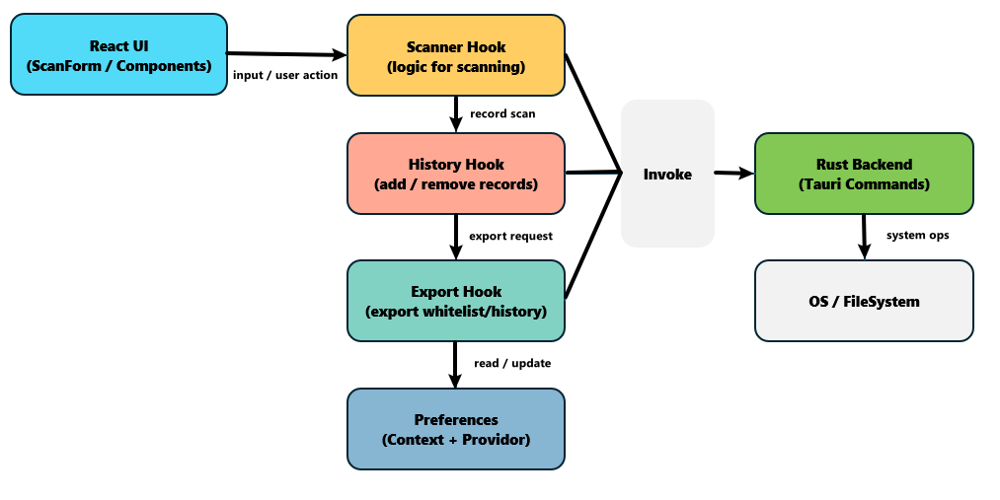
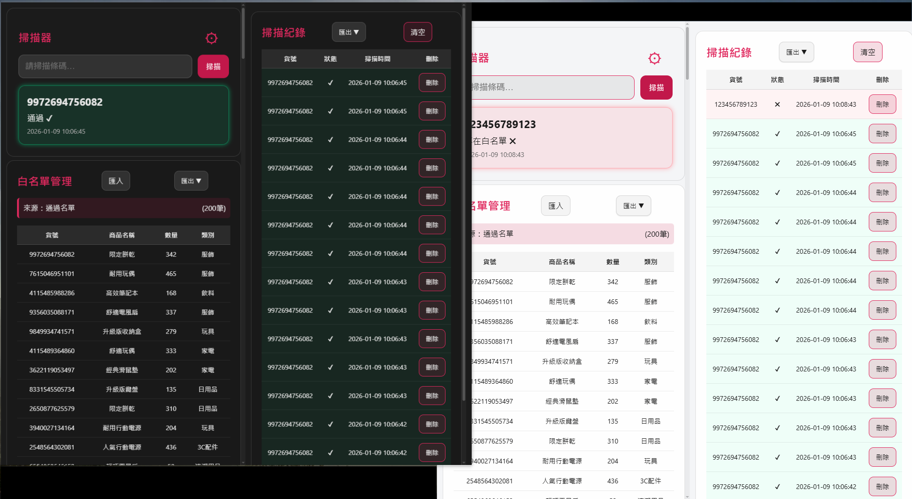
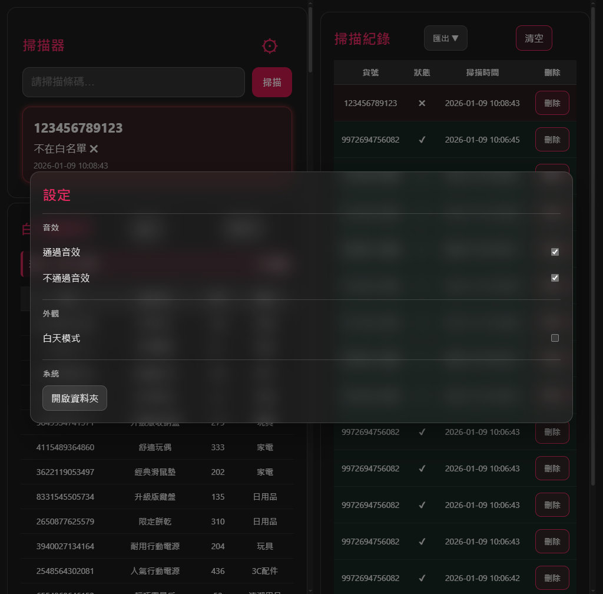
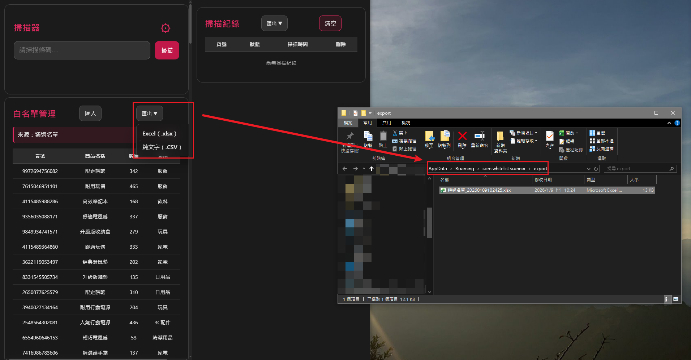

# Whitelist Scanner


## 📌 專案簡介

**Whitelist Scanner** 是一款以實務工作流程為核心設計的跨平台桌面工具，
目標是協助使用者快速判斷商品是否存在於白名單中，
並保留完整、可追蹤且可匯出的掃描紀錄。

本專案採用 **React + Tauri（Rust）** 開發，
強調清楚的責任分工、可維護的狀態管理，以及對實際使用情境的完整考量。

---

## ✨ 功能特色

.png)
.png)

- 📥 白名單匯入（CSV / XLSX）
- 🔍 條碼 / 代碼即時掃描與比對
- 🧾 掃描紀錄管理（新增、單筆刪除、清空）
- 📤 匯出白名單與掃描紀錄
- 📂 一鍵開啟匯出資料夾（跨平台）
- 🔊 通過 / 不通過音效提示（可設定）
- 🌗 白天 / 黑夜主題切換（全應用）
- ⚙️ 集中式設定面板（Modal + 遮罩）

---

## 🧱 系統架構



```
UI Layer (React)
 ├─ Components        → 純 UI 與使用者互動
 ├─ Hooks             → 掃描、紀錄、音效等行為邏輯
 ├─ Context           → 全域設定（Preferences）
 └─ Styles            → 主題與視覺系統

System Layer (Tauri / Rust)
 ├─ Import / Export   → 檔案處理
 ├─ Open Path         → 作業系統資料夾操作
 └─ Commands          → 提供 UI 呼叫的系統能力
```

> 設計原則：**UI 發出意圖，Rust 負責系統層行為**

---

## 🧠 設計理念

### 為什麼選擇 Tauri？
- 需要直接操作本地檔案系統
- 需要跨平台開啟資料夾（Windows / macOS / Linux）
- 希望兼顧效能、體積與前端開發體驗

### 為什麼設定使用 Context？
- 設定屬於全域狀態（音效、主題）
- 避免 prop drilling
- 為未來擴充設定項目保留彈性

### 為什麼音效與掃描邏輯分離？
- 掃描結果是資料
- 是否播放音效是使用者偏好
- 副作用應由獨立 Hook 處理

---

## 🎨 主題與介面設計



- 使用 CSS Variables 建立語意化色彩系統
- 以 `.theme-light` / `.theme-dark` 控制全域樣式
- 所有元件避免寫死顏色值

---

## ⚙️ 設定面板



- Modal 置於 App 層，覆蓋整個應用
- 支援背景遮罩與 ESC 關閉
- 所有設定即時生效並可持續保存

---

## 📦 匯出與資料夾管理



- Rust 端確保匯出資料夾存在
- 前端僅表達「開啟匯出資料夾」的意圖
- 避免首次使用即發生錯誤

---

## 🚀 安裝與執行

```bash
# 安裝前端依賴
npm install

# 啟動開發模式
npm run tauri dev

# 建立正式版本
npm run tauri build
```

---

## 📄 授權

本專案僅作為學習與展示用途。

---

## 🙌 結語

Whitelist Scanner 並非追求功能堆疊的專案，
而是一次關於 **架構清晰度、責任分工與實務取捨** 的完整練習。

如果你能從 README 中理解「為什麼這樣設計」，
那這個專案的目標就已經達成了一半。
